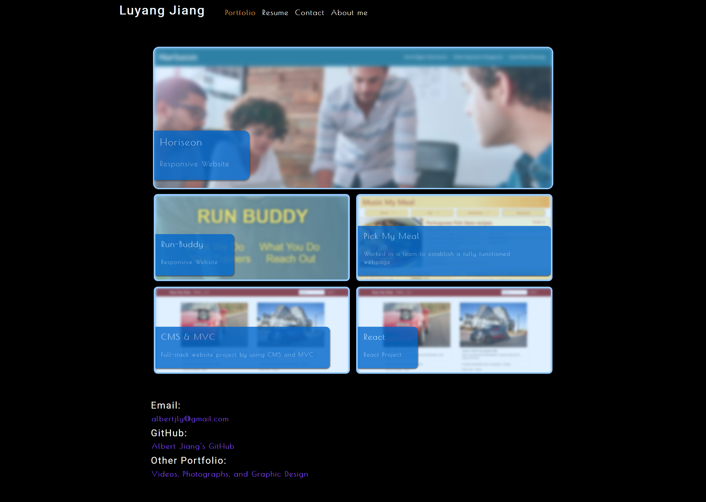

# **React Portfolio**

> ## **_Description_**

Being a web developer means being part of a community. You’ll need a place to share your projects not only if you're applying for jobs or working as a freelancer but also so that you can share your work with fellow developers and collaborate on future projects.

---

### **_Table of Contents_**

- [Installation](#installation)
- [Usage](#usage)
- [Screen Shots](#Screen-shots)
- [Demo](#demo)
- [Features](#features)
- [Contribution](#contribution)
- [License](#license)

> ## **_Installation_**

```
npm start
```

> ## **_Usage_**

Here are some technologies used in the project.

- Node
- Express
- JSX

> ## **_Screen-shots_**
>
> **`Wider Screen`**



> ## **_Demo_**

https://react-portfolio-luyang-jiang.herokuapp.com/

> ## **_Features_**

- UI updates

> ## **_Contributing_**

Albert Jiang, John Blackwell

❤️

If you created an application or package and would like other developers to contribute it, you will want to add guidelines for how to do so. The [Contributor Covenant](https://www.contributor-covenant.org/) is an industry standard, but you can always write your own.

> ## **_License_**


Copyright (c) [year] [fullname]

https://choosealicense.com/licenses/mit/
